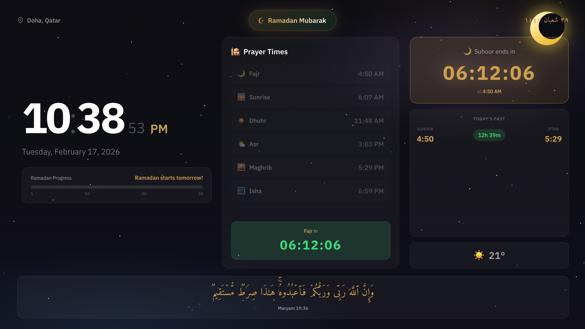

# Ramadan TV App ☪️

A beautiful Ramadan standby/screensaver app designed for Samsung Smart TV web browser.

## This Was Made With AI

I Made It With AI Because Its Fast And Easy



## Features

- **Live Clock** - 12-hour format with seconds
- **Hijri Date** - Arabic Islamic calendar display
- **Prayer Times** - Auto-fetched for your location (Doha, Qatar)
- **Iftar Countdown** - Real-time countdown to breaking fast
- **Today's Fast** - Shows Suhoor & Iftar times with fasting duration
- **Ramadan Progress** - Visual progress bar showing current day
- **Daily Quran Verse** - Arabic verse from API (changes daily)
- **Weather** - Current temperature display
- **Screen Burn Protection** - Subtle animation to prevent burn-in

## TV Remote Controls

| Button | Action |
|--------|--------|
| ◀▶▲▼ | Navigate between cards |
| OK | Select focused element |
| 🔴 Red / R | Refresh data |
| 🟢 Green / F | Toggle fullscreen |
| 🟡 Yellow / V | Load new verse |
| Back | Exit fullscreen |

*Controls auto-hide after 30 seconds of inactivity*

## Tech Stack

- Pure HTML5, CSS3, Vanilla JavaScript
- No frameworks or build tools required
- Optimized for 1920x1080 TV resolution

## APIs Used

- [Aladhan API](https://aladhan.com/prayer-times-api) - Prayer times
- [Al Quran Cloud](https://alquran.cloud/api) - Quran verses
- [wttr.in](https://wttr.in) - Weather data

## Setup

1. Host files on any web server (or use `python -m http.server 3000`)
2. Open Samsung TV web browser
3. Navigate to your server URL
4. Press **F** or 🟢 Green button for fullscreen

## Configuration

Edit `app.js` to change location:

```javascript
const CONFIG = {
    city: 'Doha',
    country: 'Qatar',
    lat: 25.2854,
    lon: 51.5310,
    ramadanStart: new Date('2026-02-18'),
    ramadanEnd: new Date('2026-03-19'),
    totalDays: 30
};
```

## License

MIT

---

رمضان مبارك 🌙